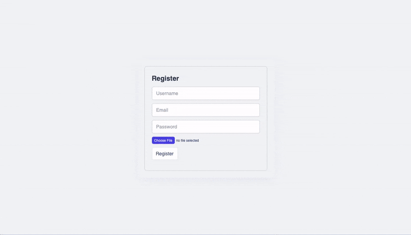
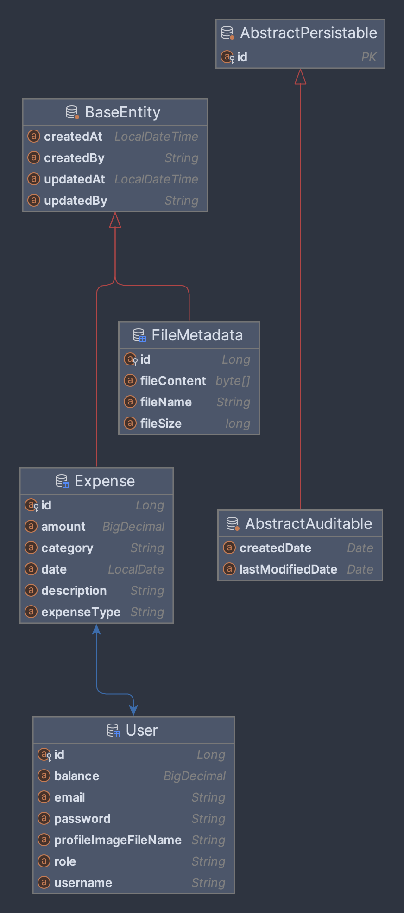

# ExpenseWise

ExpenseWise is a Personal expense tracker, designed to help users manage their expenses efficiently. It consists of a backend built with Spring Boot and a frontend built with React. Authentication and authorization are implemented using Spring Security.

<!-- ## -->

### Preview



<!-- This section displays a preview of the application in action. -->

### ER-Diagram



<!-- This section showcases the Entity-Relationship (ER) diagram for the project. -->
<!-- 
### Project dir. structure

```java
expense-tracker/
.
├── ER-Diag.
├── ER-Diag..png
├── backend
│   ├── HELP.md
│   ├── backend.iml
│   ├── mvnw
│   ├── mvnw.cmd
│   ├── pom.xml
│   ├── src
│   │   ├── main
│   │   │   ├── java
│   │   │   │   └── com
│   │   │   │       └── example
│   │   │   │           └── backend
│   │   │   │               ├── BackendApplication.java
│   │   │   │               ├── ServletInitializer.java
│   │   │   │               ├── controller
│   │   │   │               │   ├── AuthController.java
│   │   │   │               │   ├── ExpenseController.java
│   │   │   │               │   ├── FileController.java
│   │   │   │               │   └── UserController.java
│   │   │   │               ├── dto
│   │   │   │               │   ├── AuthResponse.java
│   │   │   │               │   ├── LoginRequest.java
│   │   │   │               │   └── RegisterRequest.java
│   │   │   │               ├── exception
│   │   │   │               │   └── GlobalExceptionHandler.java
│   │   │   │               ├── model
│   │   │   │               │   ├── BaseEntity.java
│   │   │   │               │   ├── Expense.java
│   │   │   │               │   ├── FileMetadata.java
│   │   │   │               │   └── User.java
│   │   │   │               ├── repository
│   │   │   │               │   ├── ExpenseRepository.java
│   │   │   │               │   ├── FileRepository.java
│   │   │   │               │   └── UserRepository.java
│   │   │   │               ├── security
│   │   │   │               │   ├── CorsConfig.java
│   │   │   │               │   └── SecurityConfig.java
│   │   │   │               ├── service
│   │   │   │               │   ├── CustomUserDetailsService.java
│   │   │   │               │   ├── ExpenseService.java
│   │   │   │               │   ├── FileService.java
│   │   │   │               │   └── FileStorageService.java
│   │   │   │               └── util
│   │   │   │                   └── FileUploadUtil.java
│   │   │   └── resources
│   │   │       ├── application.properties
│   │   │       ├── static
│   │   │       └── templates
│   │   └── test
│   │       
│   └── target
│       ├── classes
│       
├── frontend
│   ├── node_modules
│   ├── package-lock.json
│   ├── package.json
│   ├── public
│   │   ├── default-user.jpg
│   │   ├── faces
│   │   │   ├── avatar.jpg
│   │   │   .
│   │   │   └── toa-heftiba-O3ymvT7Wf9U-unsplash.jpeg
│   │   └── index.html
│   ├── readme.md
│   ├── src
│   │   ├── App.js
│   │   ├── components
│   │   │   ├── auth
│   │   │   │   ├── LoginForm.jsx
│   │   │   │   ├── Logout.js
│   │   │   │   ├── ProtectedRouteContainer.jsx
│   │   │   │   └── RegisterForm.jsx
│   │   │   ├── context
│   │   │   │   ├── AuthContext.js
│   │   │   │   └── DarkModeContext.js
│   │   │   ├── expenses
│   │   │   │   ├── ExpenseForm.jsx
│   │   │   │   ├── ExpenseItem.jsx
│   │   │   │   ├── ExpenseList.jsx
│   │   │   │   └── ExpenseSummary.jsx
│   │   │   ├── features
│   │   │   │   ├── ChartData.js
│   │   │   │   ├── ExpenseActivity.jsx
│   │   │   │   ├── LineChartComponent.jsx
│   │   │   │   ├── PieChartComponent.jsx
│   │   │   │   └── Stats.jsx
│   │   │   ├── hooks
│   │   │   │   ├── useExpenseSummary.js
│   │   │   │   ├── useLocalStorageState.js
│   │   │   │   ├── useMoveBack.js
│   │   │   │   ├── useOutsideClick.js
│   │   │   │   └── useUser.js
│   │   │   ├── pages
│   │   │   │   ├── Dashboard.jsx
│   │   │   │   ├── Expenses.jsx
│   │   │   │   ├── Login.jsx
│   │   │   │   ├── PageNotFound.jsx
│   │   │   │   ├── SplitBill.jsx
│   │   │   │   ├── UserProfile.jsx
│   │   │   │   └── users.jsx
│   │   │   ├── service
│   │   │   │   ├── ExpenseService.js
│   │   │   │   └── UserService.js
│   │   │   ├── split-bills
│   │   │   │   ├── AddFriend.jsx
│   │   │   │   ├── Friend.jsx
│   │   │   │   ├── FriendsList.jsx
│   │   │   │   └── SplitBillForm.jsx
│   │   │   ├── styles
│   │   │   │   └── GlobalStyles.js
│   │   │   ├── ui
│   │   │   │   ├── AppLayout.jsx
│   │   │   │   .
│   │   │   │   .
│   │   │   │   .
│   │   │   │   ├── UserAvatar.jsx
│   │   │   │   └── index.js
│   │   │   └── utils
│   │   │       └── helpers.js
│   │   └── index.js
│   └── webpack.config.js
└── readme.md

2282 directories, 19371 files
``` -->

<!-- Creating this app involves several steps, including setting up the backend and frontend, implementing the necessary features, and connecting them. Here's a high-level overview of the process: -->

<!-- ### Steps to Set Up the Application

1. **Set Up Backend with Spring Boot:**
   - Initialize a Spring Boot project with necessary dependencies.
   - Configure Spring Security OAuth2 for authentication.
   - Create RESTful APIs for CRUD operations on expenses.

2. **Set Up Frontend with React:**
   - Initialize a React project and install dependencies.
   - Create components for managing expenses.
   - Integrate Axios for API requests and styled-components for styling.

3. **Connect Backend and Frontend:**
   - Implement API integration using Fetch/Axios to communicate with the backend.
   - Integrate OAuth2 authentication flow in the frontend.

4. **Authentication Flow:**
   - Users authenticate through the frontend, which sends requests to the backend.
   - Backend verifies credentials and issues access tokens for authenticated users. -->

### Issues Faced and Resolutions

Here are some of the issues I faced during creating this project and how I resolved them:

**Backend Issues**

- **Redirect Issue**: After connecting to the React login endpoint, I encountered too many redirects because I was using `formLogin()` in Spring Security, which is intended for Thymeleaf or other Spring views, not for React.
- **CORS Configuration**: Addressed by configuring CORS settings in the backend to allow requests from the frontend.
- **SQL Reserved Keyword**: Was named an entity as "user" but found that it's a reserved keyword in SQL. Avoided using reserved keywords like "user" for entity names to prevent conflicts.
- **File-upload issues**: Encountered an `HttpMediaTypeNotSupportedException` and `multipart` file error while attempting to upload files. Fixed them all.
- **User mapping issue**: Encountered a user mapping issue in expenses where user is null. Currentlly fixing it.

**Frontend Issues**

- **React Redirect Issue**: `react-router-dom` requires proper configuration in webpack. You need to set `historyApiFallback: true` in the dev-server to enable routing functionality correctly. It redirects all requests to the root URL (e.g., /) so that React Router can handle them.
- **react-hhok-form issues**: Was facing issues with registering inputs fixed it.
- **Handling User Data:** Faced uncertainty about where to manage user data and how to integrate it with authentication.
- **Resolved Infinite Render Loop:** Initially encountered an infinite render loop due to incorrect logic, trying to fetch and set user details in the AuthContext directly from the `LoginForm`. Rectified by separating concerns: `LoginForm` handles authentication, setting user ID, while `useUser()` hook independently fetches user details.
- **React form issue**: React form data was not including file data and image preview was not showing.

<!-- ### Authentication flow in details

- User enters credentials in the React frontend and submits the login form.
- The frontend sends a POST request to a login endpoint in the Spring Boot backend.
- The backend validates the credentials and generates a JWT token.
- The backend sends the JWT token back to the frontend.
- The frontend stores the JWT token securely.
- Subsequent requests from the frontend to secured endpoints include the JWT token in the request headers for authentication.
- The backend verifies the JWT token for each secured request. -->

### Future Work

- Implement OAuth and JWT authentication
- Add forgot password functionality with OTP verification
- Set up testing, deployment, and CI/CD pipelines
- Implement backend for split expenses with friends and connect it with expenses
- Update user profile to include balance and other relevant information
- Add options for editing and deleting expenses
- Explore additional features and improvements
